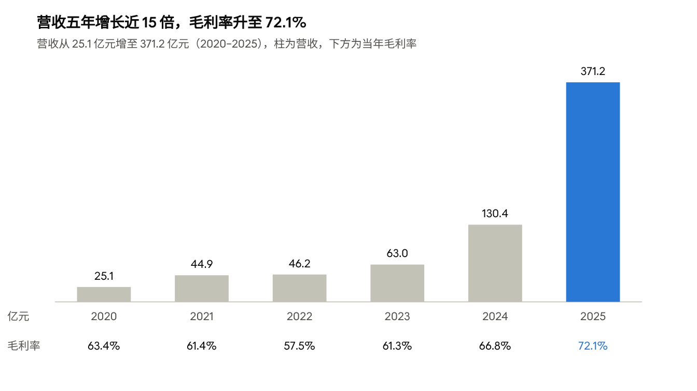

# 泡泡玛特（9992.HK）深度研究报告

2026 年 10 月 8 日

## 投资要点

**评级：买入 ｜ 目标价：200 港元 ｜ 现价：151.6 港元（2026 年 10 月 8 日）｜ 上行空间：32%**

市场把 2026 年的增速回落当成了 Labubu 泡沫破裂，我们认为这是一次高基数下的正常消化。当前 13.3 倍 2027 年 PE 已接近传统玩具公司美泰，但泡泡玛特仍保持约 70% 的毛利率和持续孵化新 IP 的能力。

1. **IP 平台能力得到验证**：2026 年上半年 THE MONSTERS 下滑 7.5%，但星星人增长 580.6% 至 26.5 亿元，公司整体收入仍增长 23.8%。对单一 IP 的依赖正在下降。
2. **国内基本盘加速而非放缓**：中国区收入增长 47.3%，线上增长 62.7%，注册会员超过 1 亿人。
3. **估值已反映悲观预期**：PE 处于近三年 1% 分位以下，较三丽鸥、万代南梦宫折价约 40%。风险收益比约 3:1。

**主要风险**：海外单店产出下滑约 40%（美洲），存货周转天数升至 201 天。这两项是未来两个季度最需要跟踪的指标。

| 亿元 | 2025A | 2026E | 2027E | 2028E |
| --- | --- | --- | --- | --- |
| 营收 | 371.2 | 394.9 | 454.2 | 517.7 |
| 经调整净利润 | 130.8 | 120.7 | 136.2 | 155.3 |
| PE（倍） | 13.8 | 15.0 | 13.3 | 11.6 |

## 一、公司概况

泡泡玛特是全球收入规模最大的自有 IP 潮玩公司。2025 年营收 371.2 亿元，同比增长 184.7%；经调整净利润 130.8 亿元，同比增长 284.5%（[新浪财经，2025 年报](https://finance.sina.com.cn/roll/2026-03-25/doc-inhseqhc9844044.shtml)）。

**发展历程**

1. 2010 年：王宁在北京创立，最初是潮流杂货集合店。
2. 2016 年：签下 Molly，转向盲盒加自有 IP 模式。
3. 2020 年 12 月：在港交所上市，代码 9992.HK。
4. 2022–2023 年：启动出海；北京泡泡玛特城市乐园开业。
5. 2024–2025 年：Labubu 全球走红，THE MONSTERS 成为百亿级 IP，海外收入爆发。
6. 2026 年：公司自称"整理年"，增速回落，海外从扩张转向精细化运营。

**2025 年收入结构（按地区）**

| 地区 | 营收（亿元） | 同比增速 | 占比 |
| --- | --- | --- | --- |
| 中国内地 | 208.5 | +134.6% | 56% |
| 亚太 | 80.1 | +157.6% | 22% |
| 美洲 | 68.1 | +748.4% | 18% |
| 欧洲及其他 | 14.5 | +506.3% | 4% |

**按 IP**：THE MONSTERS 收入 141.6 亿元（占 38%），SKULLPANDA 35.4 亿元，CRYBABY 29.3 亿元，DIMOO 27.8 亿元。共有 6 个 IP 收入超过 20 亿元，17 个 IP 超过 1 亿元。

**按品类**：毛绒品类收入 187.1 亿元，同比增长 560.6%，首次超过手办，成为第一大品类。

**渠道**：截至 2025 年末全球门店 630 家，其中中国 445 家、海外 185 家；机器人商店 2,637 台。国内累计注册会员 7,258 万人，会员贡献 93.7% 的销售额，复购率 55.7%。

## 二、行业分析

中国潮玩市场 2025 年规模 879.7 亿元，同比增长 21%，已经超过传统玩具市场（801.3 亿元）。弗若斯特沙利文预测，2026–2030 年复合增速 27.2%，2030 年达到 3,310 亿元（[华源证券，腾讯新闻转载](https://news.qq.com/rain/a/20260624A07BOH00)）。对 2026 年的规模估计，不同机构给出 1,101 亿至 1,264 亿元不等，口径差异较大，引用时需注明来源。

**产业链**：IP 创作（艺术家签约或自研）→ 设计开发 → 代工生产（主要在东莞、越南）→ 渠道零售（直营店、自助机、电商、分销）→ 二级市场（闲鱼、千岛、eBay）。价值集中在两端：掌握 IP 和渠道的公司拿走大部分利润，制造环节毛利较低。

**三个驱动因素**

- **需求端**：Z 世代的"情绪消费"。情绪经济规模 2024 年约 2.3 万亿元；谷子经济 2024 年增长 40.6% 至 1,689 亿元。
- **品类端**：搪胶毛绒是增长最快的品类，弗若斯特沙利文预计其份额将从 2025 年的 20.0% 升至 2030 年的 41.7%。AI 玩具、拼装模型是新的增长点。
- **政策端**：扩内需政策鼓励 IP 跨界合作和新消费场景。

**行业集中度**：2025 年前五大零售商合计份额 32.5%。泡泡玛特份额 21.8%，是第二名 TOP TOY（4.8%）的 4.5 倍。行业仍然分散，但头部优势在扩大。

## 三、竞争格局

国内没有第二家自有 IP 规模接近泡泡玛特的公司。主要追赶者要么靠授权 IP，要么靠零售渠道，毛利率普遍只有泡泡玛特的一半左右。更合适的估值对标是日本的 IP 公司。

| 公司 | 代码 | 模式 | 最近年度营收 | 动态 PE（倍） |
| --- | --- | --- | --- | --- |
| [泡泡玛特](https://stockanalysis.com/quote/hkg/9992/) | 9992.HK | 自有 IP + 直营渠道 | 371.2 亿元（2025） | 13.8 |
| [布鲁可](https://stockanalysis.com/quote/hkg/0325/) | 0325.HK | 授权 IP（奥特曼、变形金刚）拼搭玩具，经销商模式 | 29.1 亿元（2025） | 13.8 |
| TOP TOY（名创优品旗下） | 未上市 | 潮玩集合店，自有 IP 占比仅 5.7% | 35.9 亿元（2025） | — |
| 52TOYS | 未上市 | 授权 IP 为主（占 64.5%） | 6.3 亿元（2024） | — |
| [三丽鸥](https://stockanalysis.com/quote/tyo/8136/) | 8136.T | 自有 IP（Hello Kitty）+ 授权 | 1,941 亿日元（FY2026） | 22.1 |
| [万代南梦宫](https://stockanalysis.com/quote/tyo/7832/) | 7832.T | IP 轴战略（高达、龙珠），玩具 + 游戏 | 1.35 万亿日元（FY2026） | 22.3 |
| [美泰](https://stockanalysis.com/stocks/mat/) | MAT | 传统玩具（芭比、风火轮） | 54.9 亿美元（TTM） | 12.3 |

数据截至 2026 年 10 月 7–8 日。非上市公司数据来自[虎嗅](https://www.huxiu.com/article/4861256.html)；布鲁可营收来自其 2025 年报。

**竞争要点**

- **毛利率差距体现模式差异**：泡泡玛特 2025 年毛利率 72.1%，TOP TOY 只有 32.1%。不用付授权费、渠道以直营为主，是泡泡玛特利润率高的根本原因。
- **追赶者各有短板**：布鲁可靠降价走量，2025 年平均单价下降 30%；TOP TOY 是渠道商，缺少自有爆款；52TOYS 依赖授权，2024 年净利率仅 4.7%。
- **真正的竞争是抢消费者的时间和情绪预算**：Jellycat、三丽鸥、谷子周边、卡牌都在争取同一群年轻人。泡泡玛特的护城河在于持续推出新 IP，而不是单个 IP 本身。

## 四、商业模式与核心竞争力

泡泡玛特的本质是一家"IP 工厂 + 直营零售"公司：自己孵化 IP、自己卖，所以能拿到 70% 左右的毛利率。它的护城河有四层。

**1. IP 孵化体系：持续产出爆款**

公司签约艺术家（如 Labubu 的作者龙家升），并运营自有 IP。2025 年有 17 个 IP 收入超过 1 亿元。2026 年上半年 THE MONSTERS 收入下滑 7.5% 的同时，星星人收入增长 580.6% 至 26.5 亿元，跳升为第二大 IP（[老虎证券资讯](https://www.itiger.com/news/1178612905)）。这是"不靠单一 IP"最有力的证据。

**2. 全链路直营渠道：掌握定价权和用户数据**

2026 年上半年中国区线下收入 68.7 亿元（+35.1%），线上 47.8 亿元（+62.7%），其中抖盒机小程序 20.6 亿元、抖音 9.8 亿元。全球门店 676 家、机器人商店 2,827 台，注册会员超过 1 亿人。会员贡献 90% 以上的销售额，公司可以用数据决定下一款产品做什么、做多少。

**3. 盲盒与稀缺性机制：提高复购**

一个系列通常 12 款加 1 个隐藏款，隐藏款概率约 1/144。收集心理和二级市场溢价共同推高复购，2025 年会员复购率 55.7%。但这把双刃剑也带来风险：黄牛炒作退潮时，需求会被放大下滑。

**4. 供应链与品类扩张能力**

毛绒品类从 2024 年的不到 30 亿元增长到 2025 年的 187.1 亿元，说明公司能快速把一个 IP 搬到新品类上。

**毛利率拆解**：毛利率从 2022 年的 57.5% 升至 2025 年的 72.1%。主要有三个原因：海外售价高于国内；自有 IP 占比提升、授权费减少；规模效应下采购成本下降。2026 年上半年毛利率回落至 69.7%，主要是海外收入占比从约 40% 降至 29%。

## 五、增长驱动

2026 年上半年增长完全来自中国：中国区收入增长 47.3%，海外收入合计下滑约 9%。未来增长取决于三件事：新 IP 能否接棒、海外线下能否稳住单店产出、新业务能否形成规模。

**2026 年上半年分地区收入**

| 地区 | 1H26 收入（亿元） | 同比 | 门店数（1H25 → 1H26） |
| --- | --- | --- | --- |
| 中国 | 122.0 | +47.3% | — |
| 亚太 | 25.8 | −9.7% | 69 → 90 |
| 美洲 | 18.9 | −16.5% | 41 → 86 |
| 欧洲及其他 | 5.1 | +5.9% | 18 → 45 |

来源：[老虎证券资讯](https://www.itiger.com/news/1178612905)、[搜狐](https://www.sohu.com/a/1065515708_100126234)。

**驱动一：IP 矩阵从"一超"走向"多强"**

THE MONSTERS 收入占比从 2025 年的 38% 降至 2026 年上半年的 26%。星星人（26.5 亿元）、CRYBABY、DIMOO、SKULLPANDA 都在增长，已有 6 个 IP 半年收入超过 10 亿元。这是市场最担心的"Labubu 依赖"正在缓解的证据。

**驱动二：海外从线上爆发转向线下深耕**

海外线上收入大幅下滑（亚太 −39.8%、美洲 −45.6%、欧洲 −59.0%），线下门店收入仍在增长。线上下滑主要是 2025 年黄牛和代购需求退潮，线下数据更能反映真实消费。

但单店产出是关键隐患。美洲门店数量翻倍多（41 → 86 家），门店收入只增长 22.5%。粗略换算，平均单店收入下降约 40%。其中一部分是新店爬坡期带来的稀释，但如果 2027 年单店产出仍未恢复，海外开店的回报率将受到质疑。这是本报告建议重点跟踪的指标。

**驱动三：品类与场景延展**

公司已经延伸到城市乐园、珠宝（POPOP）、游戏和家电等领域（[36氪](https://36kr.com/p/3738211729506566)），还与 2026 年世界杯合作做 Labubu 联名。这些业务目前收入占比很小，对估值的意义在于延长 IP 生命周期，而不是短期贡献利润。

## 六、财务分析

2025 年是业绩顶点：营收增长 184.7%，经调整净利率 35.2%。2026 年上半年增速回落至 23.8%，利润率和营运效率同时走弱。

*来源：公司年报；2025 年数据来自新浪财经年报报道，2020–2024 年毛利率来自历年年报报道*

经调整净利润从 2023 年的 11.9 亿元增至 2024 年的 34.0 亿元、2025 年的 130.8 亿元，经调整净利率相应从 18.9% 升至 26.1%、35.2%。利润增速快于收入，主要来自毛利率提升和门店费用摊薄的经营杠杆。

**2026 年上半年：增速放缓，效率指标走弱**

| 指标 | 1H25 | 1H26 | 变化 |
| --- | --- | --- | --- |
| 营收（亿元） | 138.7 | 171.7 | +23.8% |
| 毛利率 | 70.3% | 69.7% | −0.6pp |
| 经调整净利润（亿元） | 47.1 | 51.6 | +9.5% |
| 经调整净利率 | 33.9% | 30.0% | −3.9pp |
| 存货周转天数 | 123 | 201 | +78 天 |

来源：[36氪](https://www.36kr.com/p/3947795568727688)、[搜狐](https://www.sohu.com/a/1065515708_100126234)；1H25 数值由 1H26 数值和同比增速倒算。

**三个值得注意的信号**

- **利润增速落后于收入增速 14 个百分点**：海外高毛利收入占比下降，同时海外新店的租金和人工成本先于收入发生。
- **存货周转天数增加 78 天**：这是最需要警惕的指标。如果下半年需求继续走弱，可能需要打折清库存，压低毛利率。
- **资产负债表依然稳健**：现金储备超过 124 亿元，资产负债率 24.9%，没有偿债压力。公司决定不派中期股息，保留现金用于海外扩张。

## 七、盈利预测

我们预计 2026 年营收 395 亿元（+6.4%），经调整净利润 121 亿元（−7.7%），为上市以来首次利润下滑。2027–2028 年恢复至 14%–15% 的收入增长。

| 亿元 | 2025A | 2026E | 2027E | 2028E |
| --- | --- | --- | --- | --- |
| 营业收入 | 371.2 | 394.9 | 454.2 | 517.7 |
| 同比增长 | 184.7% | 6.4% | 15.0% | 14.0% |
| 经调整净利润 | 130.8 | 120.7 | 136.2 | 155.3 |
| 经调整净利率 | 35.2% | 30.6% | 30.0% | 30.0% |
| 每股收益（港元） | — | 10.13 | 11.43 | 13.03 |

每股收益按经调整净利润、总股本 13.1 亿股、汇率 1 港元 = 0.91 元人民币计算。

**关键假设**

1. **2026 年下半年收入同比下滑 4%**（223 亿元 vs 2025 年下半年 233 亿元）。王宁已表示全年"大概率完不成" 20% 的增长目标；2025 年下半年是 Labubu 热度顶峰，基数极高。
2. **2026 年下半年经调整净利率 31%**，低于 2025 年下半年的 36%。原因是海外占比下降、新店费用前置，以及可能的库存清理。
3. **2027–2028 年收入增长 14%–15%**：中国区增长约 12%，海外在低基数上恢复至约 20% 增长，主要靠年内开店爬坡完成和新 IP 出海。
4. **利润率稳定在 30%**：毛利率维持在 69%–70%，费用率不再明显摊薄。

**敏感性**：2027 年收入增速每变动 5 个百分点，经调整净利润变动约 6 亿元；净利率每变动 1 个百分点，净利润变动约 4.5 亿元。

## 八、估值与评级

综合 PE 和 DCF 两种方法，目标价 200 港元，较现价 151.6 港元（2026 年 10 月 8 日）有 32% 上行空间，给予"买入"评级。

**当前估值已在历史低位**：总市值约 1,990 亿港元，对应我们预测的 2026/2027 年 PE 为 15.0/13.3 倍。市盈率处于近三年 1% 分位以下（[理杏仁](https://www.lixinger.com/equity/company/detail/hk/09992/9992)），股价较 52 周高点 291.4 港元下跌 48%（[StockAnalysis](https://stockanalysis.com/quote/hkg/9992/)）。

**方法一：相对估值（PE），目标价 206 港元**

给予 2027 年 18 倍 PE。这一倍数介于两类可比公司之间：

- 低于三丽鸥（22.1 倍）和万代南梦宫（22.3 倍）：泡泡玛特的 IP 历史更短，2026 年利润下滑，市场对其 IP 持续性仍有分歧。
- 高于美泰（12.3 倍）和布鲁可（13.8 倍）：泡泡玛特毛利率高 20–40 个百分点，增速和自有 IP 程度都更高。

**方法二：DCF，目标价 193 港元**

假设 WACC 10%、永续增长率 3%，自由现金流取经调整净利润的 90%，2029–2030 年增速分别为 10% 和 8%，加上 124 亿元净现金。

| WACC / 永续增长率 | 2% | 3% | 4% |
| --- | --- | --- | --- |
| 9% | 198 | 223 | 259 |
| 10% | 175 | 193 | 218 |
| 11% | 157 | 171 | 189 |

单位：港元/股。即使在最保守的组合下（WACC 11%、永续增长 2%），估值仍略高于现价。

**情景分析**

| 情景 | 假设 | 2027E PE | 隐含股价（港元） |
| --- | --- | --- | --- |
| 乐观 | 星星人等新 IP 持续放量，海外单店产出恢复 | 22 倍 | 251 |
| 基准 | 如盈利预测 | 18 倍 | 206 |
| 悲观 | IP 热度整体退潮，估值向美泰靠拢 | 15 倍 | 171 |

悲观情景仍假设我们的盈利预测成立。如果 2027 年利润再下调 20%，15 倍 PE 对应约 137 港元，较现价下跌约 10%。风险收益比约为 3:1。

市场共识目标价为 179.84 港元（StockAnalysis）。我们高于共识，是因为我们认为市场把 2026 年的增速回落当成了长期衰退。而星星人的表现说明，公司孵化新 IP 的能力没有变。

## 九、风险提示

1. **IP 热度退潮快于预期**：THE MONSTERS 仍占收入的 26%，如果下滑幅度从 −7.5% 扩大到 −30% 以上，而新 IP 接不上，整体收入将负增长。
2. **库存减值与毛利率下滑**：存货周转天数已升至 201 天。若需要大幅打折，毛利率可能跌破 65%。
3. **海外单店产出持续下滑**：美洲门店数翻倍而收入只增长 22.5%，若新店无法爬坡，可能需要关店并计提资产减值。
4. **二级市场价格崩塌**：隐藏款溢价是复购的重要动力，二手价格大幅下跌会削弱收集和投机需求。
5. **监管风险**：国内对盲盒销售给未成年人有限制；海外可能面临关税、产品安全和概率型商品相关的监管。
6. **估值波动**：过去 12 个月股价在 140–291 港元之间波动，外资持仓变化可能带来短期大幅波动。

## 附录：数据来源与免责声明

**数据来源**

- [新浪财经：泡泡玛特 2025 年报](https://finance.sina.com.cn/roll/2026-03-25/doc-inhseqhc9844044.shtml)
- [36氪：泡泡玛特 2026 年中期业绩](https://www.36kr.com/p/3947795568727688)
- [搜狐：泡泡玛特半年报分析](https://www.sohu.com/a/1065515708_100126234)
- [老虎证券资讯：2026 年上半年分地区与渠道数据](https://www.itiger.com/news/1178612905)
- [华源证券：中国潮玩市场规模（腾讯新闻转载）](https://news.qq.com/rain/a/20260624A07BOH00)
- [虎嗅：2026 年一季度潮玩行业财报分化](https://www.huxiu.com/article/4861256.html)
- [36氪：泡泡玛特品类扩张](https://36kr.com/p/3738211729506566)
- 行情与可比公司估值：[StockAnalysis](https://stockanalysis.com/quote/hkg/9992/)（2026 年 10 月 7–8 日）、[理杏仁](https://www.lixinger.com/equity/company/detail/hk/09992/9992)

**提交前待核对**

- 2020–2022 年营收、汇率和总股本，建议对照[港交所披露易](https://www.hkexnews.hk)上的公司年报原文。
- 引用的市场数据多来自媒体转载，正式提交前应替换为财报或券商报告原始出处。

**免责声明**：本报告为个人研究作品，仅用于求职展示，不构成任何投资建议。预测和估值基于公开信息和作者假设，实际结果可能显著不同。
